# 設定ファイル

[myconfiguration.default.py](./myconfiguration.default.py) を編集して使います。
PUBLIC_KEY の情報を入れれば十分です。サーバにアップロードする際は `myconfiguration.py` にリネームしてください。

# ed25519.py の入手元

[公式](https://ed25519.cr.yp.to/software.html)の参照実装は python2 向けなので、修正が必要でした。
[こちらの QA](https://monero.stackexchange.com/questions/9820/recursionerror-in-ed25519-py)を参考に修正版を取得してそれを使っています。
[DL元](https://github.com/bigreddmachine/MoneroPy/blob/98e7feb20bf8595e6a0d0dda06c73517f5bb3ad4/moneropy/crypto/ed25519.py)

# コマンドの登録

[registerCommand.bat](./registerCommand.bat) を実行します。第一引数に bot の token、第二引数にアプリケーションの ID を入れる必要があります

# 挙動
1. Discord がスラッシュコマンドを受ける
1. Discord が [CGI サーバ](./index.cgi) に受け付けた情報を送信する
1. [CGI サーバ](./index.cgi) がスラッシュコマンドを受けた際に受け取ったチャンネル情報を DL 待ち一覧に積む
1. [CGI サーバ](./index.cgi) が Discord に依頼を受け付けた旨を返答をする
1. DL 用ツールが DL 待ち一覧から取得すべきチャンネルの情報を取得する
1. DL 用ツールがチャンネル情報に基づいて Discord のログを収集する
1. DL 用ツールが Discord にログの情報を送信する

# 決めないといけないこと

* DL 待ち一覧はどこに持たせるのか
* どうやって DL 用ツールを動かすのか
* ログをどうやってユーザに渡すのか。Discord にアップロードするのか、手元のサーバにあげてそれを DL させるのか
